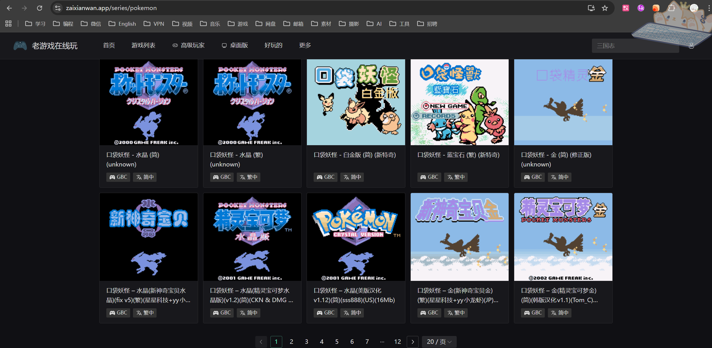
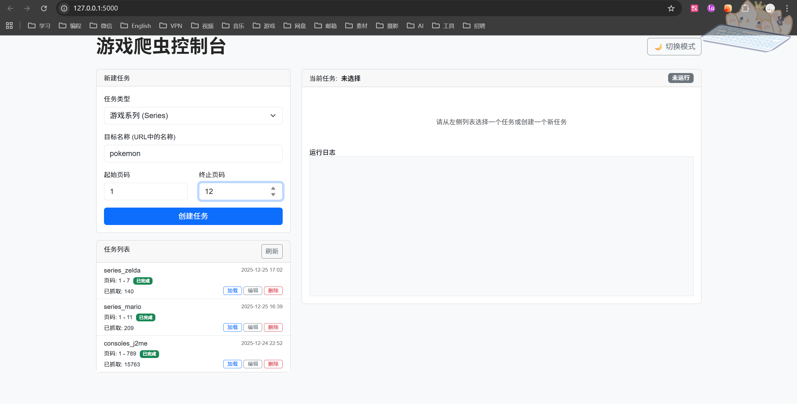
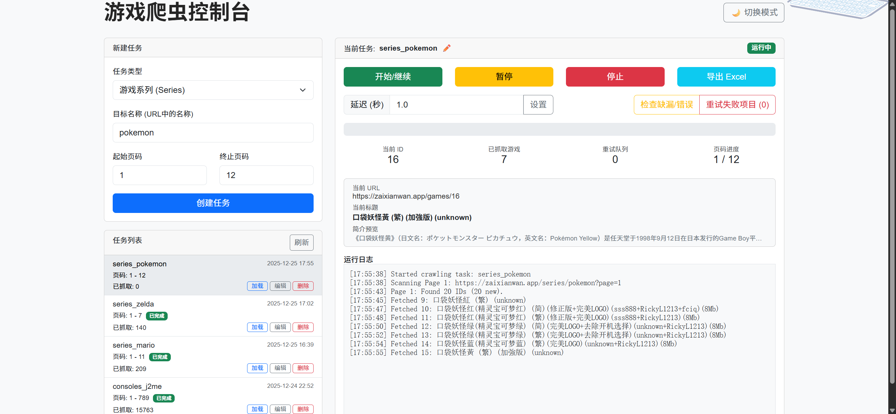
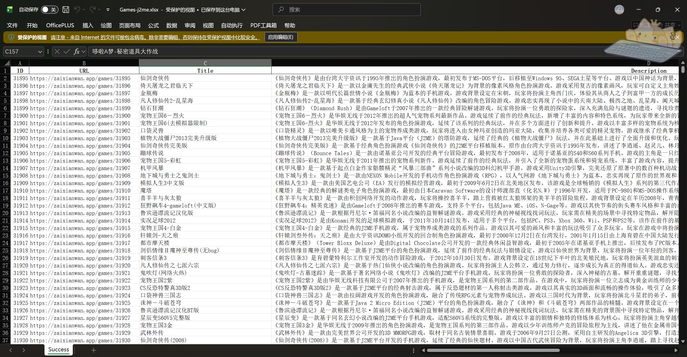
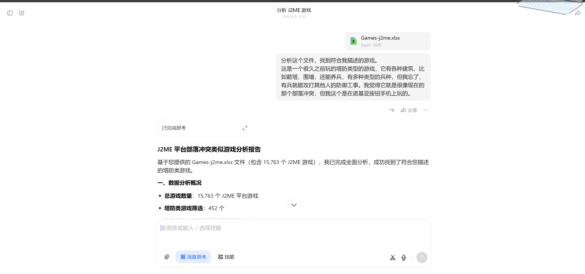
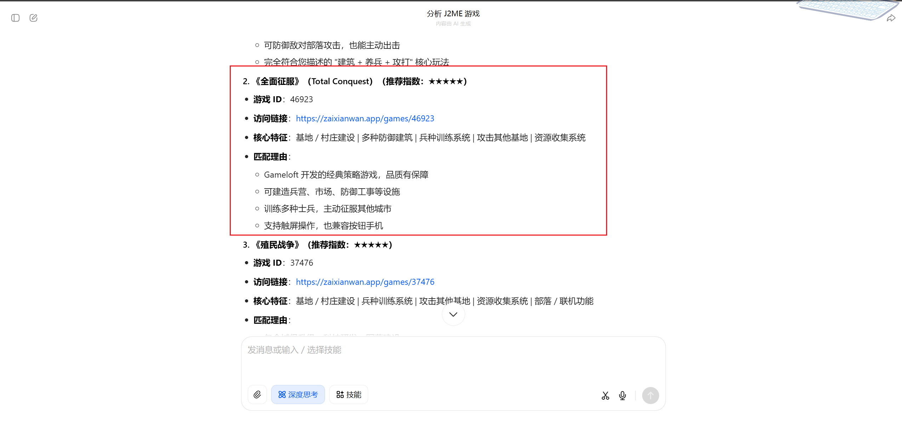

# 游戏爬虫控制台 (Game Crawler Console)

## 前言

由于小时候在诺基亚按键手机玩到一款[有意思的游戏](https://zaixianwan.app/games/46923)，但我一直都找不到这个游戏，偶然发现这个[网站](https://zaixianwan.app/)有很多[j2me游戏](https://zaixianwan.app/consoles/j2me)，我想找尝试寻找一下，奈何只知道大概的游戏内容，网站数据太多，无法检索，于是写了个脚本，获取数据，导出excel，再交给AI分析寻找。
还真被我找到了，啊啊啊啊啊，全是回忆啊。


## 安装与运行

1.  **克隆项目到本地**:
    ```powershell
    git clone https://github.com/Space3044/GAME-J2ME-Crawler.git
    ```
   
2.  **安装依赖**:
    ```powershell
    python -m venv .venv
    .venv\Scripts\Activate.ps1
    pip install -r requirements.txt
    playwright install chromium
    ```

3.  **运行程序**:
    ```powershell
    python app.py
    ```

4.  **访问界面**:
    打开浏览器访问 `http://localhost:5000`

## 使用指南

### 1. 创建任务
*   在左侧面板选择任务类型【下图红圈】。
    
*   输入目标名称（URL中的名称）【下图绿圈】。
    
*   输入起始页和终止页
*   点击“创建任务”。

### 2. 控制爬虫
*   **开始/继续**: 启动爬虫或从上次暂停处继续。
*   **暂停**: 暂时停止爬虫，保持当前进度。
*   **停止**: 完全停止爬虫任务。
*   **延迟设置**: 可以动态调整每次抓取之间的等待时间（秒）。

### 3. 错误处理与维护
*   **检查缺漏/错误**: 点击此按钮，系统会扫描当前任务的所有数据。
    *   它会找出范围内未抓取的 ID。
    *   它会找出标题为空或为特定错误信息（如“老游戏在线玩”）的项目。
    *   这些 ID 会被静默加入“重试队列”。
*   **重试失败项目**: 点击此按钮（如果红色按钮显示数量 > 0），爬虫将优先处理重试队列中的 ID。
    *   重试时，界面上的“当前 ID”会显示正在重试的项目 ID。
    *   重试成功的数据会覆盖旧的无效数据。

### 4. 数据导出
*   点击“导出 Excel”按钮下载当前任务的所有数据。

## 实操
1.  **寻找对应需要的值**
    

2.  **填入值并创建任务**
    

3.  **启动爬虫**
    

4.  **导出数据**
    

5.  **分析数据**
    
    

## 文件结构

*   `app.py`: Flask 后端服务器，处理 API 请求。
*   `crawler.py`: 核心爬虫逻辑，使用 Playwright。
*   `storage.py`: 任务数据管理（JSON 文件读写）。
*   `exporter.py`: Excel 导出逻辑。
*   `templates/index.html`: 前端界面。
*   `tasks/`: 存储任务数据的 JSON 文件目录。

## 注意事项

*   爬虫运行期间请勿关闭控制台窗口。
*   如果遇到网络错误，爬虫会自动暂停，请检查网络后点击“继续”。
